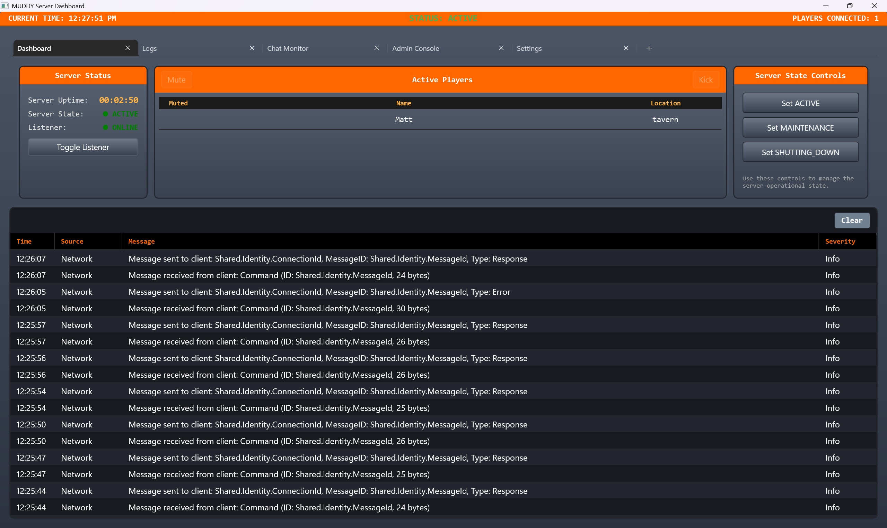
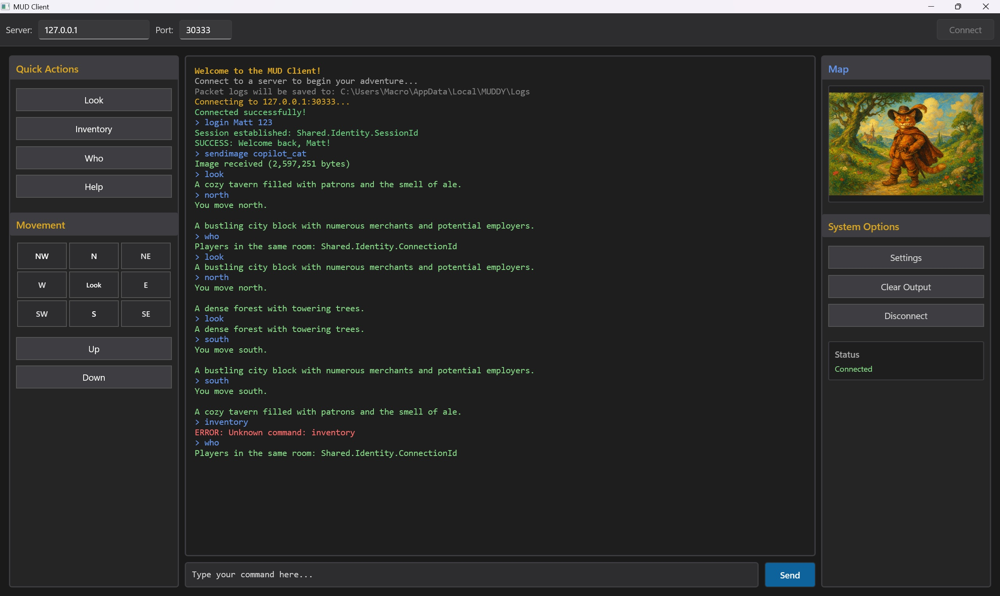

# MUDDY — Multi‑User Dungeon for Dynamic Learning

<table>
  <tr>
    <td align="center"><b>MUDDY Server GUI</b></td>
    <td align="center"><b>MUDDY Client GUI</b></td>
  </tr>
  <tr>
    <td>
      
    </td>
    <td>
      
    </td>
  </tr>
</table>

Current Version: 0.1.0  
Framework: .NET 10  
Platform: Windows (WinUI 3)  
Architecture: Event‑driven client/server system over async TCP

---

## Overview

MUDDY is an open‑source, text‑based multiplayer game composed of a standalone server and client. It is designed both as a playable MUD experience and as a reference implementation showcasing modern .NET techniques for building scalable, event‑driven networked applications.

While playable, MUDDY is intentionally structured so that developers can explore, extend, and repurpose its components.

Typical audiences include:
- Players interested in classic MUD‑style gameplay
- Developers studying client‑server architectures in .NET
- Contributors experimenting with networking, concurrency, or game systems

---

## High‑Level Architecture

MUDDY is built around a pipeline‑based command processor combined with a centralized publish/subscribe event bus. Clients connect via TCP and communicate using a lightweight custom binary protocol with JSON payloads.

On the server, each incoming command passes through a clearly defined processing pipeline:

1. Policy evaluation  
   Authentication, session validation, and server‑state enforcement.

2. Command parsing  
   Incoming JSON payloads are parsed into verb‑argument command structures.

3. Context construction  
   Player state, world state, and request metadata are assembled.

4. Command routing  
   Commands are dispatched to the appropriate handler.

5. Execution  
   Game logic or system behavior is applied.

6. Event publication  
   Domain and system events are emitted via the event bus.

7. Response dispatch  
   Messages and state updates are serialized and sent back to clients.

Each stage is isolated and testable, making the overall flow explicit and extensible.

---

## Solution Components

### Server

- Server.Core  
  Networking, command pipeline, game logic, world state, and persistence abstractions

- Server.GUI  
  WinUI 3 administrative interface for controlling server lifecycle and monitoring activity

### Client

- Client.Core  
  TCP networking, protocol handling, message routing, and session management

- Client.GUI  
  WinUI 3 client interface for gameplay interaction

### Shared Libraries

Shared functionality used by both client and server:
- Protocol definitions (TransportEnvelope, MuddyPacket serialization with CRC32)
- Event bus (BasicEventBus with publish/subscribe pattern and typed envelopes)
- Domain models (PlayerState, RoomState, WorldState)
- Strongly‑typed identity values (ConnectionId, SessionId, MessageId, RoomId)
- Logging infrastructure (packet, file, event‑bus logging)

---

## Key Technologies

- .NET 10 — modern C# features and runtime performance
- WinUI 3 — native Windows GUI framework
- Async/Await — non‑blocking I/O throughout networking and pipelines
- TCP/IP — custom binary wire format with JSON bodies
- Concurrent collections — thread‑safe state management
- CancellationTokens — controlled shutdown and lifecycle handling

---

## Implemented Features

### Server Features

Command Processing
- Multi‑stage command pipeline
- Policy checks (authentication, player state, server state)
- Verb‑based routing with extensible handlers

Authentication
- Session‑based login and registration
- Token validation on every command
- In‑memory account storage

Game World
- Room‑based navigation with 3 initial locations (Tavern, City, Forest)
- Directional movement (N / S / E / W)
- Player location tracking
- Room descriptions and interconnected exits

Chat System
- Room‑scoped broadcast messaging
- Player muting support
- Event‑based logging

Server Lifecycle Management
- Explicit state machine (LOADING, ACTIVE, MAINTENANCE, SHUTTING_DOWN)
- Graceful startup and shutdown
- Admin‑controlled state transitions

Networking
- Custom binary protocol (header + JSON + CRC32)
- Per‑connection workers
- Packet size validation
- Detailed packet logging

---

### Client Features

User Interface
- Server connection configuration (address and port)
- Command input with up/down arrow history navigation
- **Color-coded output** (chat, events, errors, commands)
- Session token management
- Binary image rendering support

Message Handling
- Handler‑based dispatch by message type
- Event‑driven UI updates
- Session token management

---

### Server Admin GUI

Dashboard
- Server runtime status (LOADING, ACTIVE, MAINTENANCE, SHUTTING_DOWN)
- Connected player overview with player list
- Real‑time event logs with timestamps and severity

Controls
- Start and stop TCP listener
- Transition server between states (ACTIVE, MAINTENANCE, SHUTTING_DOWN)
- Monitor packet logs and active connections
- Mute/kick player controls (for moderation)

---

## Protocol Overview

Transport Envelope

    {
        MessageId: Guid,
        ConnId: ConnectionId,
        SessionToken: SessionId?,
        CorrelationId: MessageId?,
        MessageType: TransportMessageType,
        Flags: MessageFlags,
        TimestampUtc: DateTime,
        Payload: byte[]
    }

Wire Format

    [Header | 28 bytes]
    [Body   | JSON + optional binary payload]
    [CRC32  | 4 bytes]

Commands

    {
      "verb": "say",
      "args": ["Hello, world"]
    }

Supported verbs include:
- **Authentication**: login, register
- **Chat**: say
- **Movement**: move, go, look, north, south, east, west, northeast, northwest, southeast, southwest, up, down
- **Player Info**: status, who, player
- **Server Admin**: serverstate
- **System**: sendimage, logout

---

## Event Bus Design

A centralized event bus decouples systems using a publish/subscribe pattern with typed event envelopes and subscriptions. The following event message types enable loose coupling across subsystems:

- **Authentication** — Login/logout, session creation and validation
- **Network** — Server-side connection events (clients joining/leaving)
- **ClientNetwork** — Client-side network events (connection status)
- **Command** — Command parsing and execution pipeline events
- **Domain** — Game-world domain events (rooms, players, items)
- **World** — World state changes (room transitions, environmental updates)
- **Player** — Player-specific events (status, condition changes)
- **Chat** — In-game chat messages and broadcasting
- **System** — Server/process lifecycle and global state transitions
- **Protocol** — Protocol-level processing (parsing, validation, serialization)
- **Gui** — GUI updates and notifications (client and admin UI)
- **Persistence** — Save/load operations and storage events
- **Log** — Structured logging events from across the system
- **Error** — Cross-cutting error reporting and recovery
- **PacketLog** — Special diagnostic channel for packet transmission events

---

## Project Structure

    Solution Root
    ├── Server.Core
    ├── Server.GUI
    ├── Client.Core
    ├── Client.GUI
    ├── Shared
    │   ├── Domain
    │   ├── EventBus
    │   ├── Identity
    │   ├── Logging
    │   └── Protocol
    ├── Server.Tests
    └── Client.Tests

---

## Design Patterns

- Pipeline
- Strategy
- Observer (pub/sub)
- Repository
- Factory
- Command
- State
- Mediator

Patterns are applied pragmatically rather than dogmatically, with an emphasis on readability and explicit flow.

---

## Getting Started

Using the Installer (Recommended)

Server
1. Run Server.Installer.exe
2. Complete the setup wizard
3. Launch MUDDY Server from the Start Menu

Client
1. Run Client.Installer.exe
2. Complete the setup wizard
3. Launch MUDDY Client from the Start Menu

---

Building from Source

    git clone https://github.com/Macroger/MUDDY.git
    cd MUDDY
    dotnet restore
    dotnet build
    dotnet test

---

## Logging and Diagnostics

- Full packet logs for client and server
- Timestamped log files
- Real‑time event tracing in the Server GUI

---

## Limitations and Scope

- In‑memory persistence only
- Plain‑text TCP (no TLS)
- Single server instance
- No inventory, combat, or NPC systems

These limitations are intentional to keep the core architecture approachable.

---

## Evolution Notes

MUDDY is an actively evolving project. Development is guided by experimentation, refactoring, and architectural exploration rather than a fixed roadmap.

---

## Contributing

Contributions are welcome. Bug fixes, improvements, and focused feature additions are encouraged.

Workflow
1. Fork the repository
2. Create a feature branch
3. Make your changes with clear, descriptive commit messages
4. Push to your fork
5. Open a Pull Request

Pull Requests are reviewed by the maintainer and may be accepted, revised, or declined depending on scope and direction.  
For significant changes, opening an Issue first is recommended.

---

## License

Licensed under the Apache License 2.0. See LICENSE for details.

---

## Author

Matthew Schatz  
https://github.com/Macroger

---

## Acknowledgments

- .NET and WinUI teams
- Community Toolkit contributors
- Doxygen
- Claude (Anthropic's AI assistant) for architectural discussion, documentation assistance, and project organization

---

## About This Project

This project leverages modern .NET practices with intentional architecture for learning. Key documentation (LEARNING.md, CODING_STYLE.md, CONTRIBUTING.md) was created with the assistance of Claude under the guidance of Matthew Schatz to ensure clarity and consistency. The project represents both a functional MUD implementation and a teaching resource for .NET developers interested in networked, event-driven architectures.